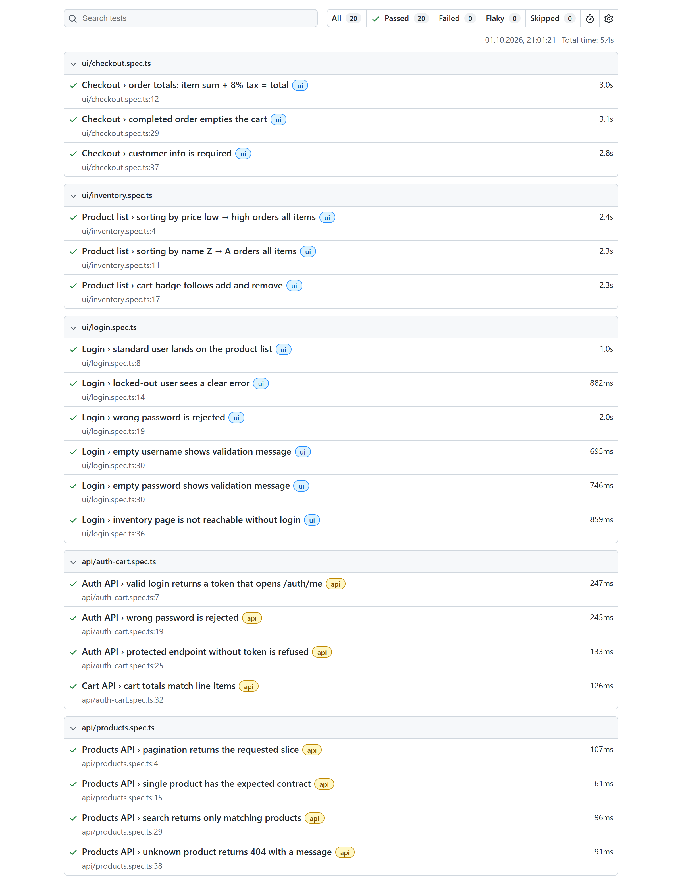
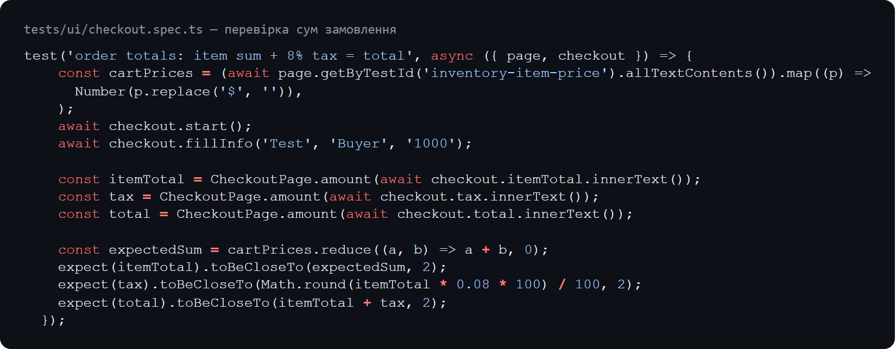

# Playwright UI + API tests: demo online shop

[](https://github.com/VValedol/saucedemo-playwright-tests/actions/workflows/playwright.yml)

A compact, production-style test suite written with [Playwright](https://playwright.dev/) and TypeScript.

- **UI:** [saucedemo.com](https://www.saucedemo.com/), a public demo shop made for test automation practice.
- **API:** [dummyjson.com](https://dummyjson.com/), a public fake REST API.



## What is covered (20 tests)

| Area | Checks |
|------|--------|
| Login (UI) | valid login, locked-out user, wrong password, empty username or password, direct URL without a session |
| Product list (UI) | sorting by price and by name, cart badge on add and remove |
| Checkout (UI) | item sum + 8% tax = total, completed order empties the cart, required customer fields |
| Products API | pagination and `select`, response contract, search relevance, 404 for an unknown id |
| Auth API | token login and `/auth/me`, wrong password → 400, missing token → 401 |
| Cart API | line totals and cart total add up, discounted total ≤ total |

## How it is built

- **Page Object Model** (`pages/`) keeps selectors in one place; tests read like scenarios.
- **Custom fixtures** (`tests/ui/fixtures.ts`) provide page objects and a ready logged-in session.
- Stable `data-test` selectors via `testIdAttribute`; no sleeps or hard-coded waits.
- Two Playwright projects, `ui` and `api`, which run in parallel.
- HTML report, plus a trace and screenshot on failure.
- **CI:** GitHub Actions runs a type check and the full suite on every push and weekly, and uploads the report as an artifact.



## Run locally

```bash
npm ci
npm test                          # all tests (locally uses installed Google Chrome)
CI=1 npm test                     # use Playwright's Chromium instead (after `npx playwright install chromium`)
npm run test:ui                   # UI only
npm run test:api                  # API only
npm run report                    # open the HTML report
```

The demo credentials used in the tests are the public ones published by saucedemo.com and dummyjson.com.
